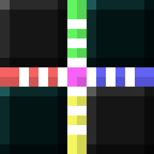

# Psionic Utilities
A Psi addon to make spell programming easier

This mod is client side only, you don't have to install it on the server to use it

## Features
- Color coded connectors based on which piece they connect to
- Change between Extract X, Y and Z with hotkeys (planned: config panel buttons)
- Improved Number Constant editing
- Planned: hotkey to highlight tricks, unused, dependency and dependent pieces
- Planned: insert Cross Connectors with shift-arrow

## Addon support
- [Phi](https://www.curseforge.com/minecraft/mc-mods/phi): supported
- [Magical Psi](https://www.curseforge.com/minecraft/mc-mods/magical-psi-redux): planned
